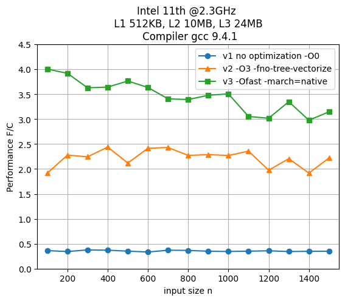
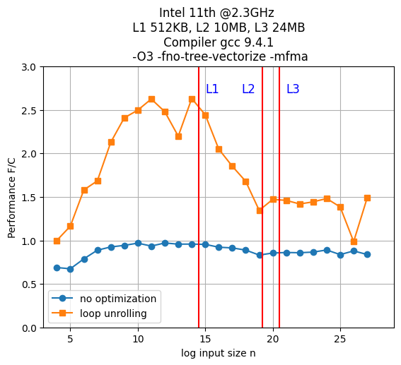
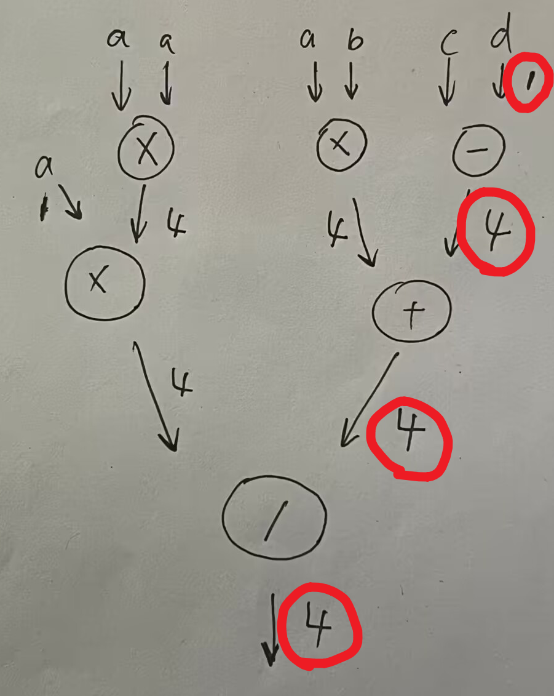
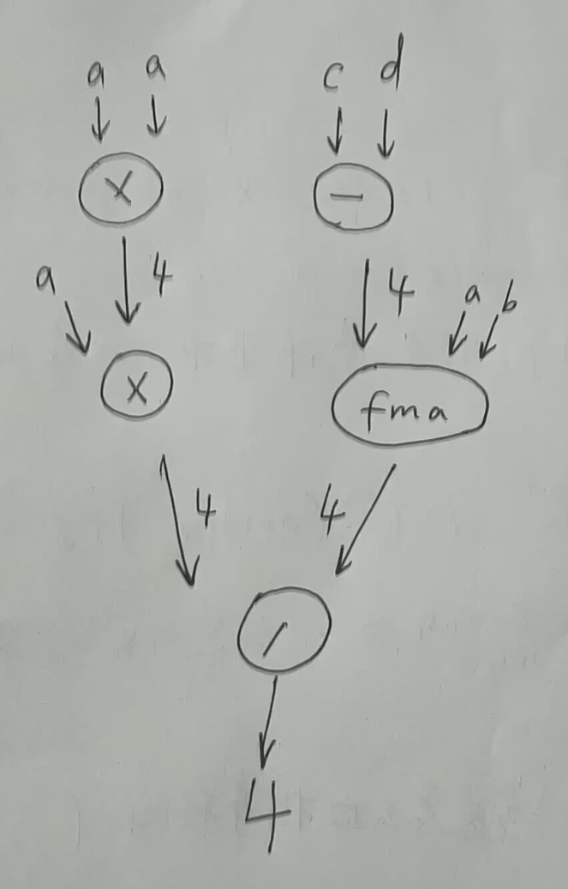

# Homework 1

## Problem 1

### - abcd

This is the relevant part of lscpu output:

CPU(s):                          16

CPU family:                      6

Model:                           141

Model name:                      11th Gen Intel(R) Core(TM) i7-11800H @ 2.30GHz

So in summary:

| Processor manufacturer | Intel      |
|------------------------|------------|
| name                   | i7-11800H  |
| number (of CPUs)       | 16         |
| microarchitecture      | Tiger Lake |

### - e

On my computer, it's using `divsd` from SSE2. 

It still supports x87 mostly for backward compatablity and portabily, also x87 has 80 bits precision, someone may use `long double` in some scene. Also x87 provides several trigonometric operations like `fsin`, `fcos`, something like that.

### -f 

x87 by default internally use 80-bit representation, and 80-bit contains 1 bit for sign, 15 bits for the exponent, 64 bits for the significand.

x86 conforms to IEEE 754 64-bit standard, containing 1 bit for sign, 11 bits for exponent, 52 for significand.

### -g

According to https://www.intel.com/content/www/us/en/docs/intrinsics-guide/index.,html#text=_mm256_fmadd_ps&expand=2520,2520&ig_expand=3107, CPI 0.5, which means it can issue two FMAs in one cycle.

FMA contains two float operations, so 4 FLOP/s in total.

### -h

According to https://www.intel.com/content/www/us/en/docs/intrinsics-guide/index.html#expand=2520,2520&text=addsd&ig_expand=4726,4720,5671,5671,2659,171,2659,2653,164, both `addsd` and `addss` have latency of 4 and throughput 2.

The names are `addsd` and `addss`.

### -i

According to https://www.intel.com/content/www/us/en/docs/intrinsics-guide/index.html#expand=2520,2520&text=RSQRT14_ss&ig_expand=4726,4720,5671,5671, latency is 4 and throughput is 1, instruction name is: `RSQRTSS`

### -j

According to https://www.intel.com/content/www/us/en/docs/intrinsics-guide/index.html#expand=2520,2520&ig_expand=4726,4720,5671,5671,171,164,6278,5671,2659&text=divss and https://www.intel.com/content/www/us/en/docs/intrinsics-guide/index.html#expand=2520,2520&ig_expand=4726,4720,5671,5671,171,164,6278,5671,2659,2653&text=divsd, instruction names are `divss` and `divsd`. 

Latency of single precision is 11, throughput is 0.33.
Latency of double precision is 14, throughput is 0.25.

However, these data is slightly different from the data in Intel Optimization Manual. Also, agner's blog has different data.

## Problem 2

### -b (i) and (ii)

The total number of fp operations is $W = \frac{n(n-1)(2n+1)}{2}$.

Consider only reads, at least we need to read the matrix $U$ so $Q \ge 8n^2$.

So operational intensity is $I = \frac{W}{Q} \le \frac{n}{8} - \frac{1}{16} - \frac{1}{16n} \le \frac{n}{8}$ flops/byte.

### -cd

The plot:



+ Non-optimized (v1): It contains no optimization at all, so no vectorization, no math simplification. Performance is low and flat, like a straight line.

+ Optimized but non-vectorized (v2): The performance is better than in the previous case. But Instruction parallelism is not good since calculation within the loop has strong dependency.

+ Fully optimized (v3): The -Ofast flag enable fast math, which enables ILP and fully vectorization, it significantly improves performance. As the matrix goes larger, performance declines a bit but not too much.

In summary, the highest performance is 4 flops per cycle.

## Problem 3

### -a

$C(n) = C_{mul} \cdot N_{mul} + C_{add} \cdot N_{add}$

where $C_{mul}, C_{add}$ are cost of multiplication and addition, $N$'s are number of corresponding operations.

### -b

We need to determine number of multiplication and addition. It takes 2 multiplications and 3 additions (subtraction is also a kind of addition) for each $i \in [n]$, so:

$$
N_{mul} = 2n
$$


$$
N_{add} = 3n
$$

$$
C(n) = C_{mul} \cdot (2n) + C_{add} \cdot (3n)
$$

### -c

+ i) There are $5n$ of fp operations in total and can be scheduled on port 0 and port 1 so a lower bound is $5n / 2 = 2.5n$ cycles.

+ ii) Note that we won't get any benefit from opening parenthesis, so only the final addition can be fused into a FMA instruction. So we will have $n$ multiplications, $2n$ additions, and $n$ FMA operations, $4n$ in total scheduled on port 0 and port 1 so lower bound of $2n$ cycles.

+ iii) There are 5 vectors so $5n$ fp values in total. According to the bandwith provided in slides, $r_{L3} = 5n / 4, r_{RAM} = 5n / 2$.

### -d

Each FMA seen as 2 fp operations, so $5n$ operations in total; and we need to read $5n$ fp values, so:

$$
I(n) \le \frac{5n}{8 * (5n)} = \frac{1}{8} \;\text{flops/byte}
$$

## Problem 4

### -abcde

The plot:



The calculation can be easily turned into two FMA operations. According to Intel's manual, FMA operation for scalar has latency of 4 cycles and there is an obvious data dependency within outer loop: `z[k] += result`. Here in each iteration of outer loop, `z[k]` needs to be fetched and added, then stored, so the next iteration cannot start until previous iteration finishes. In summary, under the limitation of data dependency, ILP won't be good.

In conclusion, two FMA operations within inner loop can be executed in parallel, but FMAs in outer loop cannot. FMA operation has latency of 4 cycles so there will be at least $n * 4 = 4n$ cycles in total. The number of flops is $4n$ in total, so an upper bound for performance would be $\pi(n) \le 1$. 

The plot shows that when data size increases, the performance is almost 1 flop/cycle, and it's flat among different data size.

The optimization is obvious: we've already discussed about the data dependency, so we can avoid it by unrolling the loops and introuce auxiliary variables for summation.

This is the optimized code is:

```C
void comp(double *x, double *y, double *z, int n) {
    for (int i = 0; i < n; i += 4) {
    //     for (int k = 0; k < 2; k++) {
    //         z[k] += x[i + 1 - k] * y[i + k];
    //     }
        double s01 = x[i + 1] * y[i];
        double s11 = x[i] * y[i + 1];
        double s02 = x[i + 2] * y[i + 1];
        double s12 = x[i + 1] * y[i + 2];
        double s03 = x[i + 3] * y[i + 2];
        double s13 = x[i + 2] * y[i + 3];
        double s04 = x[i + 4] * y[i + 3];
        double s14 = x[i + 3] * y[i + 4];
        z[0] += s01 + s02 + s03 + s04;
        z[1] += s11 + s12 + s13 + s14;
    }
}
```

After tuning, unrolling four loops tends to be most efficient.

**Analysis**:

The original version suffers from data dependency, which has significant influence on ILP. The infered upper is 1 but the real performance is about 2, I still didn't figure out why. I've turned off overclock and checked cpu frequency using a library provided by intel. Take that aside, original code has a flat performance, among all kinds of problem size, which meets the expectation.

After optimization, the performance is much better, but varies among different input size. When data fits in L1 cache, performance is the best, and as the size grows, when exceeds L1 cache, performance declines quickly. However, there's no obvious difference between size fiiting in L2 cache and L3 cache, which means at that time cache miss is not the bottleneck anymore. The maximum performance is: 5.1 flops/cycle.

## Problem 5

### -a

When no FMA instruction is generated, the dependency graph would be:



So the runtime would at least be $4 + 4 + 4 + 1 = 13$ cycles, since the length of critical path is $13$. There is a delay of $1$ cycle of subtraction of $c, d$ because each cycle skylake can only issue two `mul` or `add`.

### -b

When FMA instructions are generated, the dependency graph would be:



The runtime would at least be $4 + 4 + 4 = 12$ cycles. Each cycle skylake can issue two instructions, including FMA operations, so no delay occurs.

